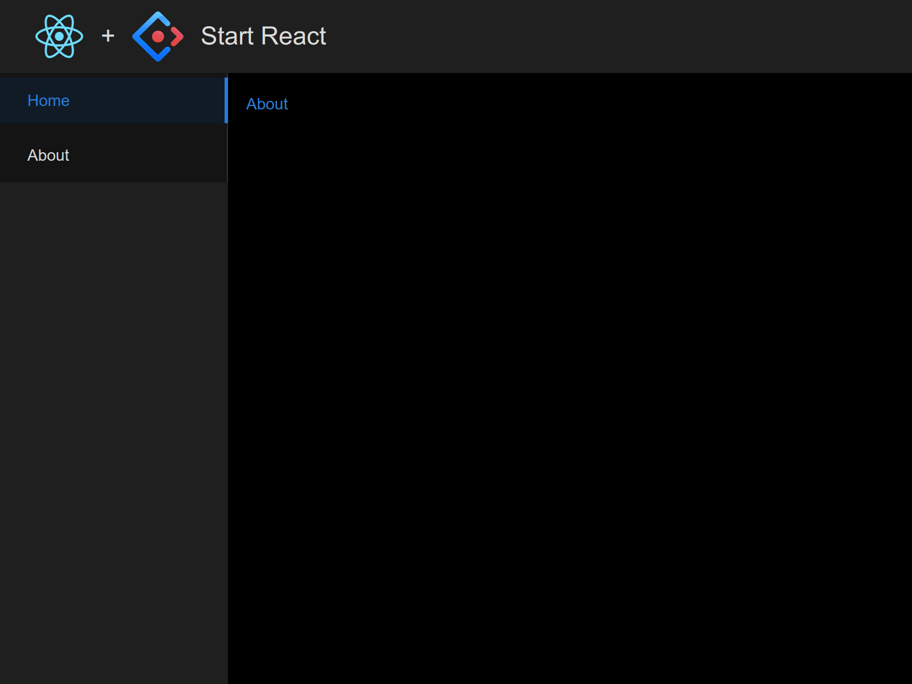

# React Antd 从零准备

## React App

```bash
yarn create react-app start-react --template typescript
cd start-react
```

## React Router

路由库，以便导航样例。

```bash
yarn add react-router-dom
```

## Antd

组件库，以便布局 UI。

```bash
yarn add antd @ant-design/icons
```

[高级配置](https://ant.design/docs/react/use-with-create-react-app-cn#%E9%AB%98%E7%BA%A7%E9%85%8D%E7%BD%AE)，

```bash
yarn add @craco/craco -D
yarn add craco-less
```

`craco.config.js` 配置了深色主题：

```js
const path = require('path');
const CracoLessPlugin = require('craco-less');
const { getThemeVariables } = require('antd/dist/theme');

module.exports = {
  plugins: [
    {
      plugin: CracoLessPlugin,
      options: {
        lessLoaderOptions: {
          lessOptions: {
            modifyVars: getThemeVariables({
              dark: true,
              // compact: true,
            }),
            javascriptEnabled: true,
          },
        },
      },
    },
  ],
  webpack: {
    alias: { '@': path.resolve(__dirname, './src') },
  },
};
```

<!--
yarn add @svgr/webpack -D
-->

## ESLint

VSCode 安装 ESLint Prettier 扩展。初始化 `eslint`：

```bash
$ npx eslint --init
✔ How would you like to use ESLint? · style
✔ What type of modules does your project use? · esm
✔ Which framework does your project use? · react
✔ Does your project use TypeScript? · No / Yes
✔ Where does your code run? · browser
✔ How would you like to define a style for your project? · guide
✔ Which style guide do you want to follow? · airbnb
✔ What format do you want your config file to be in? · JavaScript
```

配置 [.eslintrc.js](../.eslintrc.js) [.eslintignore](../.eslintignore) [.vscode/settings.json](../.vscode/settings.json)。并于 `package.json` 添加：

```js
"scripts": {
  "lint": "eslint . --ext .js,.jsx,.ts,.tsx --ignore-pattern node_modules/"
},
```

执行 `yarn lint` 通过， `yarn start` 运行。

## 最后

到此， React Antd 应用就准备好了。初始模板如下，可见首个提交：



<!--
yarn add eslint-import-resolver-alias -D
-->
